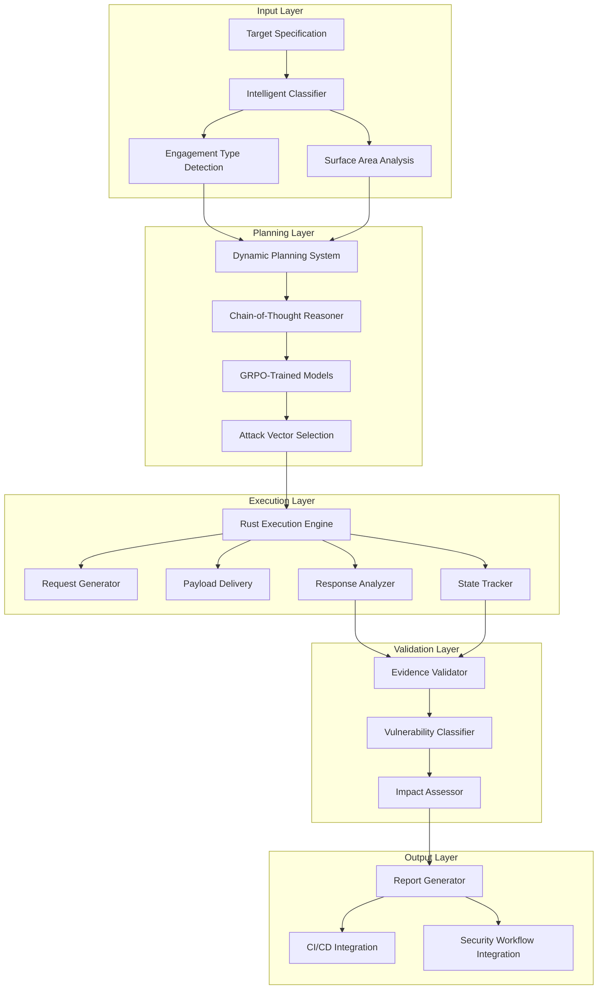

# Design Document: Agentic Pentest AI Architecture

## Overview

The Agentic Pentest AI system is a sophisticated security validation platform designed specifically for high-value, transaction-heavy digital commerce environments. The architecture combines advanced AI reasoning capabilities with high-performance execution engines to deliver evidence-driven security testing that dramatically reduces false positives while focusing on real-world exploitability.

The system employs a multi-layered approach: intelligent classification determines the optimal testing strategy, GRPO-trained models prioritize verifiable vulnerabilities, chain-of-thought reasoning plans complex attack sequences, and a Rust-based execution engine delivers payloads with precision and efficiency. This design ensures that security validation becomes an integral part of CI/CD pipelines while maintaining the safety and performance requirements of production commerce environments.

## Architecture

The system follows a modular, event-driven architecture with clear separation of concerns:



The architecture supports horizontal scaling through containerization and can be deployed across multiple environments (development, staging, production) with environment-specific safety controls and rate limiting.

## Components and Interfaces

### Intelligent Classifier

The Intelligent Classifier serves as the system's entry point, analyzing target specifications to determine optimal testing approaches.

**Core Responsibilities:**
- Engagement type classification (VA, PT, or full VAPT)
- Target surface identification (web apps, APIs, AI services)
- Commerce-critical component detection
- Testing methodology adaptation

**Interface Definition:**
```rust
pub trait IntelligentClassifier {
    async fn classify_engagement(&self, target: &TargetSpec) -> EngagementType;
    async fn identify_surface(&self, target: &TargetSpec) -> Vec<SurfaceType>;
    async fn detect_commerce_components(&self, target: &TargetSpec) -> Vec<CommerceComponent>;
    async fn adapt_methodology(&self, classification: &Classification) -> TestingStrategy;
}

pub struct Classification {
    pub engagement_type: EngagementType,
    pub surface_types: Vec<SurfaceType>,
    pub commerce_components: Vec<CommerceComponent>,
    pub risk_profile: RiskProfile,
}
```

The classifier uses lightweight ML models for rapid categorization, with results cached to improve performance for similar targets.

### Dynamic Planning System

The Dynamic Planning System orchestrates the overall testing strategy using advanced reasoning capabilities.

**Core Responsibilities:**
- Multi-step attack sequence planning
- Evidence validation checkpoints
- State change correlation
- Attack vector prioritization

**Interface Definition:**
```rust
pub trait DynamicPlanner {
    async fn plan_attack_sequence(&self, strategy: &TestingStrategy) -> AttackPlan;
    async fn validate_evidence(&self, evidence: &Evidence) -> ValidationResult;
    async fn correlate_state_changes(&self, changes: &[StateChange]) -> CorrelationResult;
    async fn prioritize_vectors(&self, vectors: &[AttackVector]) -> Vec<PrioritizedVector>;
}

pub struct AttackPlan {
    pub phases: Vec<AttackPhase>,
    pub evidence_checkpoints: Vec<EvidenceCheckpoint>,
    pub rollback_strategies: Vec<RollbackStrategy>,
    pub success_criteria: Vec<SuccessCriterion>,
}
```

The planner integrates with GRPO-trained models to ensure attack sequences focus on observable, verifiable outcomes rather than speculative vulnerabilities.

### GRPO-Trained Models

Based on research findings, GRPO (Group Relative Policy Optimization) models provide superior performance for security applications by comparing groups of responses and optimizing for verifiable outcomes.

**Model Architecture:**
- 4-bit quantized models using Unsloth optimization
- LoRA adapters for domain-specific fine-tuning
- Group-based reward functions prioritizing evidence
- Continuous learning from validation feedback

**Interface Definition:**
```rust
pub trait GRPOModel {
    async fn generate_payload(&self, context: &AttackContext) -> Payload;
    async fn evaluate_response(&self, response: &Response) -> EvaluationScore;
    async fn update_policy(&self, feedback: &ValidationFeedback) -> UpdateResult;
    async fn compare_groups(&self, groups: &[ResponseGroup]) -> GroupComparison;
}

pub struct ValidationFeedback {
    pub evidence_quality: f32,
    pub exploitability_score: f32,
    pub false_positive_penalty: f32,
    pub business_impact: f32,
}
```

The models are trained on curated datasets of verified vulnerabilities with emphasis on commerce-specific attack patterns and real-world exploitability.

### Rust Execution Engine

The high-performance execution engine handles all payload delivery, response analysis, and state tracking operations.

**Core Responsibilities:**
- Deterministic request generation
- Concurrent payload delivery
- Real-time response analysis
- Comprehensive state tracking
- Performance monitoring

**Interface Definition:**
```rust
pub trait ExecutionEngine {
    async fn generate_request(&self, payload: &Payload) -> HttpRequest;
    async fn deliver_payload(&self, request: &HttpRequest) -> DeliveryResult;
    async fn analyze_response(&self, response: &HttpResponse) -> AnalysisResult;
    async fn track_state(&self, state_change: &StateChange) -> TrackingResult;
}

pub struct DeliveryResult {
    pub response: HttpResponse,
    pub timing_metrics: TimingMetrics,
    pub state_changes: Vec<StateChange>,
    pub error_conditions: Vec<ErrorCondition>,
}
```

The engine implements sophisticated rate limiting, circuit breakers, and safety mechanisms to prevent disruption of production systems while maintaining testing effectiveness.

### Evidence Validation System

The Evidence Validation System ensures all reported vulnerabilities are backed by concrete, verifiable proof.

**Core Responsibilities:**
- Concrete evidence verification
- State change validation
- Impact demonstration
- False positive filtering

**Interface Definition:**
```rust
pub trait EvidenceValidator {
    async fn verify_evidence(&self, evidence: &Evidence) -> VerificationResult;
    async fn validate_state_change(&self, change: &StateChange) -> ValidationResult;
    async fn demonstrate_impact(&self, vulnerability: &Vulnerability) -> ImpactDemo;
    async fn filter_false_positives(&self, findings: &[Finding]) -> Vec<ValidatedFinding>;
}

pub struct Evidence {
    pub evidence_type: EvidenceType,
    pub proof_artifacts: Vec<ProofArtifact>,
    pub reproducibility_steps: Vec<ReproductionStep>,
    pub impact_metrics: ImpactMetrics,
}
```

## Data Models

### Core Domain Models

```rust
// Target specification and classification
pub struct TargetSpec {
    pub url: String,
    pub authentication: Option<AuthConfig>,
    pub environment_type: EnvironmentType,
    pub business_criticality: CriticalityLevel,
    pub allowed_operations: Vec<Operation>,
}

pub enum EngagementType {
    VulnerabilityAssessment,
    PenetrationTest,
    FullVAPT,
}

pub enum SurfaceType {
    WebApplication,
    RestAPI,
    GraphQLAPI,
    AIBackedService,
}

pub enum CommerceComponent {
    AuthenticationFlow,
    PaymentAPI,
    UserDataEndpoint,
    BusinessLogicWorkflow,
    InventoryManagement,
    OrderProcessing,
}

// Attack planning and execution
pub struct AttackVector {
    pub vector_id: String,
    pub category: AttackCategory,
    pub payload_template: PayloadTemplate,
    pub success_indicators: Vec<SuccessIndicator>,
    pub risk_level: RiskLevel,
}

pub struct Payload {
    pub payload_id: String,
    pub content: PayloadContent,
    pub delivery_method: DeliveryMethod,
    pub expected_responses: Vec<ExpectedResponse>,
}

pub struct StateChange {
    pub change_id: String,
    pub timestamp: DateTime<Utc>,
    pub component: String,
    pub before_state: serde_json::Value,
    pub after_state: serde_json::Value,
    pub change_type: ChangeType,
}

// Evidence and validation
pub struct Vulnerability {
    pub vulnerability_id: String,
    pub severity: SeverityLevel,
    pub category: VulnerabilityCategory,
    pub evidence: Evidence,
    pub business_impact: BusinessImpact,
    pub remediation_guidance: RemediationGuidance,
}

pub struct Finding {
    pub finding_id: String,
    pub vulnerability: Vulnerability,
    pub confidence_score: f32,
    pub validation_status: ValidationStatus,
    pub discovered_at: DateTime<Utc>,
}
```

### Configuration Models

```rust
pub struct SystemConfig {
    pub execution_limits: ExecutionLimits,
    pub safety_controls: SafetyControls,
    pub model_config: ModelConfig,
    pub integration_config: IntegrationConfig,
}

pub struct ExecutionLimits {
    pub max_concurrent_requests: u32,
    pub request_timeout: Duration,
    pub rate_limit_per_second: u32,
    pub max_payload_size: usize,
}

pub struct SafetyControls {
    pub production_mode: bool,
    pub destructive_operations_allowed: bool,
    pub auto_throttle_enabled: bool,
    pub emergency_stop_threshold: f32,
}

pub struct ModelConfig {
    pub grpo_config: GRPOConfig,
    pub lora_config: LoRAConfig,
    pub inference_config: InferenceConfig,
}
```

## Error Handling

The system implements comprehensive error handling with graceful degradation and recovery mechanisms:

### Error Categories

1. **System Errors**: Infrastructure failures, network issues, resource exhaustion
2. **Model Errors**: Inference failures, model loading issues, context overflow
3. **Target Errors**: Unreachable targets, authentication failures, rate limiting
4. **Validation Errors**: Evidence verification failures, state inconsistencies
5. **Safety Errors**: Production impact detection, emergency stop triggers

### Error Handling Strategy

```rust
pub enum SystemError {
    InfrastructureError(InfrastructureError),
    ModelError(ModelError),
    TargetError(TargetError),
    ValidationError(ValidationError),
    SafetyError(SafetyError),
}

pub trait ErrorHandler {
    async fn handle_error(&self, error: &SystemError) -> RecoveryAction;
    async fn log_error(&self, error: &SystemError, context: &ErrorContext);
    async fn notify_operators(&self, error: &SystemError) -> NotificationResult;
}

pub enum RecoveryAction {
    Retry { delay: Duration, max_attempts: u32 },
    Fallback { alternative_strategy: Strategy },
    Abort { reason: String, cleanup_required: bool },
    EmergencyStop { immediate: bool },
}
```

### Circuit Breaker Implementation

The system implements circuit breakers at multiple levels:
- Per-target rate limiting and failure detection
- Model inference failure protection
- System resource exhaustion prevention
- Production impact emergency stops

## Testing Strategy

The testing strategy employs a dual approach combining unit testing for specific scenarios with property-based testing for comprehensive validation of universal properties.

### Unit Testing Approach

Unit tests focus on:
- **Component Integration**: Verify interfaces between system components
- **Edge Cases**: Test boundary conditions and error scenarios
- **Configuration Validation**: Ensure system configurations are properly validated
- **Safety Mechanisms**: Verify emergency stops and safety controls function correctly

Example unit test structure:
```rust
#[cfg(test)]
mod tests {
    use super::*;
    
    #[tokio::test]
    async fn test_classifier_handles_invalid_target() {
        let classifier = IntelligentClassifier::new();
        let invalid_target = TargetSpec::invalid();
        
        let result = classifier.classify_engagement(&invalid_target).await;
        assert!(matches!(result, Err(ClassificationError::InvalidTarget)));
    }
    
    #[tokio::test]
    async fn test_emergency_stop_triggers_correctly() {
        let engine = ExecutionEngine::new();
        let high_impact_scenario = create_high_impact_scenario();
        
        let result = engine.execute_with_safety_checks(&high_impact_scenario).await;
        assert!(matches!(result, ExecutionResult::EmergencyStop));
    }
}
```

### Property-Based Testing Configuration

Property-based tests validate universal correctness properties using the `proptest` crate with minimum 100 iterations per test. Each test references its corresponding design property and validates requirements traceability.

**Testing Framework Setup:**
```rust
use proptest::prelude::*;

// Configure property test parameters
const MIN_TEST_ITERATIONS: u32 = 100;
const MAX_TEST_ITERATIONS: u32 = 1000;

proptest! {
    #![proptest_config(ProptestConfig {
        cases: MIN_TEST_ITERATIONS,
        max_shrink_iters: 10000,
        ..ProptestConfig::default()
    })]
}
```

**Property Test Implementation Pattern:**
Each property-based test follows this structure:
- Generate random valid inputs using custom generators
- Execute the system operation
- Verify the universal property holds
- Include proper test tagging for traceability

Example property test:
```rust
proptest! {
    // Feature: agentic-pentest-ai, Property 1: Evidence validation consistency
    #[test]
    fn evidence_validation_is_consistent(
        evidence in arbitrary_evidence(),
        validator_config in arbitrary_validator_config()
    ) {
        let rt = tokio::runtime::Runtime::new().unwrap();
        rt.block_on(async {
            let validator = EvidenceValidator::new(validator_config);
            
            // Property: For any evidence, validation should be deterministic
            let result1 = validator.verify_evidence(&evidence).await.unwrap();
            let result2 = validator.verify_evidence(&evidence).await.unwrap();
            
            prop_assert_eq!(result1.is_valid, result2.is_valid);
            prop_assert_eq!(result1.confidence_score, result2.confidence_score);
        });
    }
}
```

**Test Data Generators:**
Custom generators create realistic test data:
```rust
fn arbitrary_target_spec() -> impl Strategy<Value = TargetSpec> {
    (
        "https://[a-z]{3,10}\\.[a-z]{2,3}/.*",
        option::of(arbitrary_auth_config()),
        prop_oneof![
            Just(EnvironmentType::Development),
            Just(EnvironmentType::Staging),
            Just(EnvironmentType::Production)
        ]
    ).prop_map(|(url, auth, env_type)| TargetSpec {
        url,
        authentication: auth,
        environment_type: env_type,
        business_criticality: CriticalityLevel::High,
        allowed_operations: vec![Operation::Read, Operation::Write],
    })
}
```

### Integration Testing

Integration tests validate end-to-end workflows:
- Complete attack sequence execution
- CI/CD pipeline integration
- Multi-component interaction validation
- Performance under realistic load conditions

### Performance Testing

Performance tests ensure the system meets operational requirements:
- Concurrent request handling capacity
- Model inference latency under load
- Memory usage patterns during extended operation
- Recovery time from failure scenarios

## Correctness Properties

*A property is a characteristic or behavior that should hold true across all valid executions of a system—essentially, a formal statement about what the system should do. Properties serve as the bridge between human-readable specifications and machine-verifiable correctness guarantees.*

The following properties define the universal behaviors that must hold across all system operations, ensuring correctness, safety, and reliability of the agentic pentest AI architecture.

### Property 1: Classification Consistency
*For any* target specification provided to the system, the Intelligent Classifier should always produce a deterministic classification result containing exactly one engagement type, at least one surface type, and consistent methodology adaptation for identical target characteristics.
**Validates: Requirements 1.1, 1.2, 1.4**

### Property 2: Evidence-Driven Validation
*For any* potential vulnerability identified by the system, it should only be reported if concrete evidence of exploitability exists, including verifiable proof of impact and observable state changes rather than pattern-based detection.
**Validates: Requirements 5.1, 5.2, 5.3, 5.4**

### Property 3: Chain-of-Thought Attack Planning
*For any* attack sequence generated by the Dynamic Planning System, each step should logically follow from the previous step with concrete evidence validation checkpoints, and no step should proceed without validated evidence from the prior step.
**Validates: Requirements 2.1, 2.2**

### Property 4: GRPO Optimization Consistency
*For any* set of vulnerability candidates, the GRPO-trained models should consistently prioritize those with verifiable exploitability and observable state changes over theoretical risks or pattern-based detections.
**Validates: Requirements 3.1, 3.2, 3.4**

### Property 5: State Change Tracking Completeness
*For any* attack execution sequence, all state changes should be tracked and correlated across multiple attack steps, with no state modifications going unrecorded during the testing process.
**Validates: Requirements 2.3, 4.2**

### Property 6: Deterministic Execution Engine Behavior
*For any* identical payload and target configuration, the Rust execution engine should produce identical requests and maintain consistent performance characteristics suitable for CI/CD integration.
**Validates: Requirements 4.1, 4.4**

### Property 7: Commerce-Critical Component Prioritization
*For any* commerce platform target, the system should automatically prioritize authentication flows, payment APIs, user data endpoints, and business logic workflows over other components when commerce-critical components are detected.
**Validates: Requirements 1.3, 7.1, 7.2, 7.3, 7.4**

### Property 8: Vulnerability Report Actionability
*For any* vulnerability discovered and reported, the report should include verifiable proof of impact and sufficient detail for security analysis and remediation planning.
**Validates: Requirements 5.3**

### Property 9: Model Optimization Efficiency
*For any* model fine-tuning or deployment operation, the system should use 4-bit LoRA techniques for memory efficiency, Unsloth optimization for latency reduction, while maintaining deep reasoning capabilities and cost-effectiveness.
**Validates: Requirements 6.1, 6.2, 6.3, 6.4**

### Property 10: Response Analysis Completeness
*For any* payload delivery and response, the Rust engine should parse and correlate data across multiple attack vectors, ensuring comprehensive analysis that captures all relevant security indicators.
**Validates: Requirements 4.3**

### Property 11: Payload Generation Measurability
*For any* generated payload, it should be designed to produce measurable system responses that enable concrete evidence collection rather than relying on speculative or pattern-based detection methods.
**Validates: Requirements 3.3**